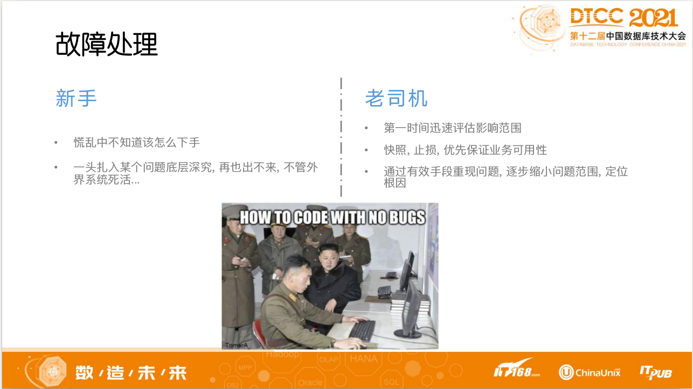

# DTCC2021 内容提要

[[_TOC_]]

## 数据库内核

### 优化器

- [2-赵衎衎-工业化SQL优化器技术蓝图1015](浪潮云溪定制专场（PPT）/2-赵衎衎-工业化SQL优化器技术蓝图1015.pdf)
    - 理想的SQL优化器应该具备的功能
    - 传统优化器用了哪些算法来选择执行路径

### 内存管理

- [张道山-GBase 8s 在金融行业的技术实践](专场7-金融行业数据库技术实践（下）（PPT）/张道山-GBase 8s 在金融行业的技术实践.pdf)
    - 

### 事务日志WAL

- [吕海波-PG内核源码增进二三事](专场1-数据库内核技术（PPT）/吕海波-PG内核源码增进二三事.pdf)
    - 优化PostgreSQL Partial Writes(页裂)体系大幅提升整体性能
    - [On the impact of full-page writes](https://www.2ndquadrant.com/en/blog/on-the-impact-of-full-page-writes/)
    - 关闭全页写，可能会造成数据丢失(系统异常宕机之后)，但会有30%的性能提升

## 数据库使用实践

### PostgreSQL

- [母延年-PostgreSQL在OLAP场景实战演练](专场4-分布式数据库应用最佳实践（上）（PPT）/母延年-PostgreSQL在OLAP场景实战演练-分享版pptx.pdf)
    - 扩展实现了外部存储，利用lucene构建倒排索引，实现全字段检索
    - 
- [赵飞祥 -纲举目张-金融业务PostgreSQL实践与体系规范——定稿](专场17-数据架构设计与实践（下）（PPT）/赵飞祥 -纲举目张-金融业务PostgreSQL实践与体系规范——定稿.pdf)
    - 必要的时候可以学习一下 PG 使用规范
        - 考虑全球化需求,所有字符存储和表示,均以UTF-8编码。所有数据内与时间相关的数据,时区均为UTC时间,最好使用int或bigint存储秒或毫秒。业务程序可以根据需求,进行前端显示的时区转换。
        - 多个Table中相同的列,或者进行Join的列,需要保证列名一致,数据类型一致
        - 建议所以可以添加comment的地方均添加comment,且以英文描述
        - 有定时海量数据需要归档和删除的表,应考虑表按时间列分区,归档后清理时,不要使用delete,而是用drop或truncate清理对应表
        - 对于频繁使用的大表(大小超过10GB,或者记录数超过1000万)应考虑进行分区,保证单表比较小,可以提升查询效率、更新的效率、创建索引的效率、备份恢复的效率等。
        - 在count(distinct col)中,只计算非NULL列的不重复结果,NULL列不会被计算。
        - 大批量删除和更新数据时,不要再一个事物中完成,建议分批次操作,避免一次产生较多日志,对系统资源和相关系统产生不好的影响
        - 冷热数据要进行分离,尽量保证线上实例只存在有限的经常查询的数据
        - 应尽量避免在 where子句中使用 != 或 <> 操作符,这种不等于会让PG放弃索引,使用全表扫描。
        - 对于无用的索引要及时删除,无用的索引不仅会导致更新数据的代价变大,还可能产生错误的执行计划。

### Greenplum及衍生数据库

- [陶征霖-OushuDB性能调优实战](专场1-数据库内核技术（PPT）/陶征霖-OushuDB性能调优实战.pdf)
    - 基于 GP 的商业数据库，最后提到了性能分析的若干手法
- [翁岩青- X 时序数据库，从无”关”到有”关”](专场1-数据库内核技术（PPT）/翁岩青- X 时序数据库，从无”关”到有”关”.pdf)
    - 基于 GP 的超融合数据库，同时支持时序数据，以及关系模型写入
    - 保证高速写入是依赖 MatrixGate 组件，数据存储则是扩展实现了一个 行列混存引擎MARS 
    - 支持数据多态存储，冷热数据迁移是依赖内部提供的 自动分区管理 功能
    - 
- [姚延栋_时序数据库终局探讨1020](专场19- 时序数据库（PPT）/姚延栋_时序数据库终局探讨1020.pdf)
    - B-Tree vs LSM
    - 
    - 
     

### Redis Cluster

- [代晓磊-360分布式数据库选型与最佳实践2](专场9-分布式数据库技术最佳实践（下）（PPT）/代晓磊-360分布式数据库选型与最佳实践2.pdf)
    - 虽然还穿插了TiDB的内容，但Redis Cluster最佳实践可以简单看一下，运维工具用了哪些，不过看着比较陈旧
- [葛辉-缓存平台在美菜网的实践v2](专场16-NoSQL数据库/葛辉-缓存平台在美菜网的实践v2.pdf)
    - Redis使用过程中缺乏治理能力,抗风险能力差
    - Redis调整无法对研发透明,机房搬迁等投入人力成本大
- [郭磊涛-爱奇艺高性能KV数据库研发与应用](专场17-数据架构设计与实践（下）（PPT）/郭磊涛-爱奇艺高性能KV数据库研发与应用.pdf)

### Elasticsearch

- [武云峰-Elasticsearch基于对象存储的冷热分离架构以及NLP特性增强实践](专场4-分布式数据库应用最佳实践（上）（PPT）/武云峰-Elasticsearch基于对象存储的冷热分离架构以及NLP特性增强实践.pdf)
    - Elasticsearch索引冷热分离存储的实践，用对象存储让存储成本上降了10倍
    - 百度云ES提供的NLP中文分词

### Prometheus

- [冯若航-Prometheus数据模型与应用](专场19- 时序数据库（PPT）/冯若航-Prometheus数据模型与应用.pdf)
    - PromQL入门进阶指南
- Prometheus 驱动 K8S 资源使用率优化，自动扩缩容
    - https://github.com/Telefonica/prometheus-kafka-adapter 源头项目

### ClickHouse

- [陈峰-滴普基于ClickHouse的实时分析引擎应用实践-脱敏版](主会场2-数造未来（PPT）/陈峰-滴普基于ClickHouse的实时分析引擎应用实践-脱敏版.pdf)
    - 优势是 列式，压缩；劣势也比较明显: 不支持事务, 不适合点查, 仅能批量删除或修改数据
    - ClickHouse 冷数据存储对接了 juiceFS，而 juiceFS 可以支持 S3 的后端

### Apache IoTDB

- [黄向东-工业物联网时序数据库Apache IoTDB新特性与应用实践](专场19- 时序数据库（PPT）/黄向东-工业物联网时序数据库Apache IoTDB新特性与应用实践.pdf)

## 数据库运维管理

### 使用规范

- [刘晨-防微杜渐，浅谈规范化设计开发对数据库性能的影响](专场18-性能优化与SQL审计（PPT）/刘晨-防微杜渐，浅谈规范化设计开发对数据库性能的影响.pdf)
    - 
    - 
    - 
    - 

### 数据库部署

- [向安杰-基于kubernetes的云数据库建设实践1017](专场3-云原生数据库开发与实践（上）（PPT）/向安杰-基于kubernetes的云数据库建设实践1017-向安杰.pdf)
    - MySQL Operator 建设实践
        - Kubernetes 是一个可移植的、可扩展的开源平台,用于管理容器化的工作负载和服务,拥有庞大且快速增长的生态系统。基于k8s构建服务,极大的方便我们的运维、开发工作。
        - 针对 MySQL 这种有状态、有角色的服务,我们定义了 MySQL 自己的 CRD,并提供配套的 Controller,对原生的k8s资源进行扩展。

### 数据库监控

- [金学东-金仓数据库云服务解决方案-v1.6](专场3-云原生数据库开发与实践（上）（PPT）/金学东-金仓数据库云服务解决方案-v1.6(2)(1).pdf)
    - 

### 数据库优化

- [叶桦-关系型数据库性能优化浅谈](专场18-性能优化与SQL审计（PPT）/叶桦-关系型数据库性能优化浅谈.pdf)
- [数据库优化思维导图](http://assets.processon.com/chart_image/60f633ab5653bb66635a32f1.png)
    - 个人总结的，欢迎点赞

### 数据库代理

- [张亮-Apache ShardingSphere 在 Database Plus 的蓝海探索](专场6-数据架构设计与实践（上）（PPT）/张亮-Apache ShardingSphere 在 Database Plus 的蓝海探索.pdf)
    - 中间件方式会减少已上线业务的额外开发成本，更通用，更灵活
    - 依赖语法解析来实现，避免在中间件中配置大量的正则规则
    - 
    - .png)
    - 

### 混合云场景

- [赵闪-斗鱼数据库混合云架构实践](专场14-数据库安全与智能运维（上）（PPT）/赵闪-斗鱼数据库混合云架构实践.pdf)
    - 如何实现数据库平滑迁移
    - 混合云场景下的负载均衡和故障切换
    - 云原生场景下的数据库运维挑战

### 数据库平台

- [冯光谱-为研发体系赋能的数据库平台建设实践-V6](专场6-数据架构设计与实践（上）（PPT）/冯光谱-为研发体系赋能的数据库平台建设实践-V6.pdf)
    - 大规模开发,只是规范,落不了地!
        - 架构标准化，借助 Proxy
        - 规范化流程化
        - SQL规范固化
        - 元数据建设
    - 让研发自己动手,丰衣足食
        - 服务自助化 - SQL工单
        - 服务自助化 - 慢SQL
        - 服务自助化 – binlog统计探针

### 稳定性治理

- [王海华-货拉拉大数据平台的稳定性治理实践](专场13-数据治理（PPT）/王海华-货拉拉大数据平台的稳定性治理实践.pdf)
    - 稳定性的建设是风险控制能力建设,而非靠运气
    - 稳定性的提升依靠事实和数据,而非靠感觉
    - 稳定性的目标实现靠端到端体系化建设,而非靠单点突破
- [陈阳 - B 站数据库服务治理之路](专场20-数据库安全与智能运维（下）（PPT）/陈阳 - B 站数据库服务治理之路.pdf)
    - 
    - 

### 智能运维

- [雷尚顺-DBbrain：新一代量化指标驱动的云上数据库自治平台](专场8-云原生数据库开发与实践（下）（PPT）/雷尚顺-DBbrain：新一代量化指标驱动的云上数据库自治平台.pdf)
- [蔡金龙-数据库异常智能分析与诊断](专场20-数据库安全与智能运维（下）（PPT）/蔡金龙-数据库异常智能分析与诊断-V2.pdf)
    - 全量SQL采集演进策略、技术方案和技术实现
    - 
    - [网络云根因智荐的探索与实践](https://mp.weixin.qq.com/s/QMbsV1609NVx60zI1CKffw)
- [张鹏-58同城风控实践-脱敏版](专场21-人工智能与大数据应用（下）（PPT）/张鹏-58同城风控实践-脱敏版.pdf)
    - 异常检测算法
    - 

### 硬件支撑

- [姜海-宝存的Gen4企业级SSD产品系列, 优势及未来产品服务考量](专场12-数据存储与加速（PPT）/姜海-宝存的Gen4企业级SSD产品系列, 优势及未来产品服务考量.pdf)
- [魏兴华-内存计算和可计算存储在数据库场景中的应用](专场12-数据存储与加速（PPT）/魏兴华-内存计算和可计算存储在数据库场景中的应用.pdf)
    - 偏硬件，没理解，欢迎告知

## 数据库技术科普

### 数仓，数据湖

- [吴小前-滴普湖仓一体架构探索与实践](专场3-云原生数据库开发与实践（上）（PPT）/吴小前-滴普湖仓一体架构探索与实践-.pdf)
- [尹翔--京东零售数据仓库演进之路](专场11-企业数据中台设计与实践（PPT）/尹翔--京东零售数据仓库演进之路.pdf)
    - 批流一体实时数仓解决方案
    - 

### HTAP

- [朱阅岸-HTAP系统的问题与主义之争](专场1-数据库内核技术（PPT）/朱阅岸-HTAP系统的问题与主义之争.pdf)
    - 内核实现上的差异
- [唐建法-Real Time DaaS：面向TP业务的数据平台架构公开版](专场11-企业数据中台设计与实践（PPT）/唐建法-Real Time DaaS：面向TP业务的数据平台架构公开版.pdf)
    - 

### 数据库选型

- [林春-金融云数据库的应用与实践v1.0](专场7-金融行业数据库技术实践（下）（PPT）/林春-金融云数据库的应用与实践v1.0.pdf)
    - 

### 分布式事务

- [张文-TDSQL全局一致性读技术详解](专场2-金融行业数据库技术实践（上）（PPT）/张文-TDSQL全局一致性读技术详解.pdf)
    - 如何解决分布式事务的难题，那转账为案例很经典
- [多语言环境下分布式事务实践](专场9-分布式数据库技术最佳实践（下）（PPT）/叶东富-多语言环境下分布式事务实践.pdf)
    - 分布式事务框架DTM

### 数据治理

- [王金杰-网易数据中台系统架构设计实践](专场11-企业数据中台设计与实践（PPT）/王金杰-网易数据中台系统架构设计实践.pdf)
    - 
- [马伟凯-模态数据融合治理实践20211020_外发(2)](专场13-数据治理（PPT）/马伟凯-模态数据融合治理实践20211020_外发(2).pdf)
    - PAI实施方法论介绍
- [谢辉-滴普数据智能平台建设与应用-脱敏版](专场13-数据治理（PPT）/谢辉-滴普数据智能平台建设与应用-脱敏版.pdf)
    - 开篇开的挺好，后面讲的也实用
- [胡赵勇-分布式架构下数据共享与数据交换-最终版](专场17-数据架构设计与实践（下）（PPT）/胡赵勇-分布式架构下数据共享与数据交换-最终版.pdf)
    - 数据的价值，核心价值

### 数据安全

- [伊人-大数据安全、隐私保护与隐私计算](专场15-人工智能与大数据应用（上）（PPT）/伊人-大数据安全、隐私保护与隐私计算.pdf)
- [应以峰-“零信任”数据安全与主动式智能运维](专场14-数据库安全与智能运维（上）（PPT）/应以峰-“零信任”数据安全与主动式智能运维.pdf)
    - 上下班巡检